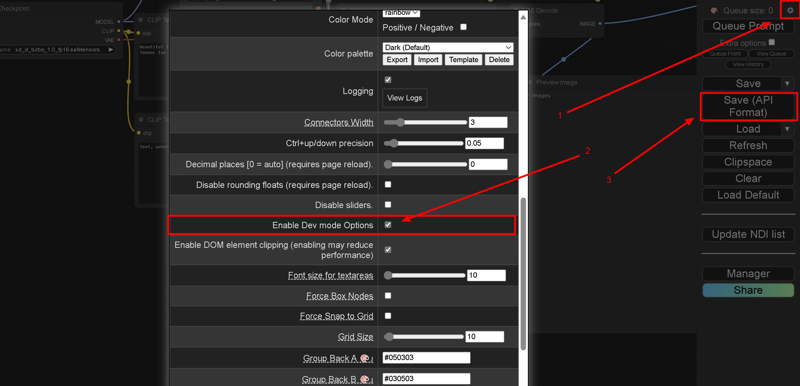

<!--

WARNING: This file is auto-generated by snipinator. Do not edit directly.
SOURCE: `README.md.jinja2`.

-->
<!-- Note: This file is a jinja2 template of a Markdown file.                -->
<!--


-->

# README

**Warning:** Very raw and unmaintained code. Use at your own risk. Mainly
intended as a starting point.

![Top language][19] ![GitHub License][11] [![PyPI - Version][12]][13]
[![Python Version][18]][13]

| Branch  | Build Status              |                                              |
| ------- | ------------------------- | -------------------------------------------- |
| Master  | [![Build and Test][1]][2] | [![since tagged][14]][20] ![last commit][16] |
| Develop | [![Build and Test][3]][4] | [![since tagged][15]][21] ![last commit][17] |

```
ComfyUI API Endpoint <| <=  Comfy Catapult <=> HTTP Server <| <=  Public users
                     <|                                    <|
                     <|         Your python program        <| Your Webui/JS frontend
                     <|                                    <|
                     <|           Your workflows           <|
                     <|          Your HTTP server          <|
```

## What is it?

Comfy Catapult is a library for scheduling and running ComfyUI workflows from a
Python program, via the existing API endpoint. ComfyUI typically works by
hosting this API endpoint for its user interface.

This makes it easier for you to make workflows via the UI, and then use it from
a program.

### Scheduling a job

From
[`comfy_catapult/catapult_base.py`](comfy_catapult/catapult_base.py):

````py
  async def Catapult(
      self,
      *,
      job_id: str,
      prepared_workflow: dict,
      important: Sequence[APINodeID],
      job_debug_path: Path | None = None,
  ) -> dict:
    """Schedule a ComfyUI workflow job.

    Args:
        job_id (str): A unique identifier for the job. Note: This string must
          be unique, and must be slugified! Use python-slugify to slugify the
          string.
        prepared_workflow (dict): Workflow to submit.
        important (List[APINodeID]): List of important nodes (e.g output nodes we
          are interested in).
        job_debug_path (Path, optional): Path to save debug information. If
          None, will use sensible defaults.

    Raises:
        WorkflowSubmissionError: Failed to submit workflow.

    Returns:
        dict: The history of the job returned from the ComfyUI API.
    """
````

From
[`examples/sdxlturbo_example_catapulter.py`](examples/sdxlturbo_example_catapulter.py):

````py
class ExampleWorkflowInfo:
  # Direct wrapper around the ComfyUI API.
  client: ComfyAPIClientBase
  # Job scheduler (the main point of this library).
  catapult: ComfyCatapultBase
  # Something to help with retrieving files from the ComfyUI storage.
  remote: RemoteFileAPIBase
  comfy_api_url: str

  # This should be the workflow json as a dict.
  workflow_template_dict: dict
  # This should begin as a deep copy of the template.
  workflow_dict: dict
  # This will hold the node ids that we must have results for.
  important: List[APINodeID]

  # Make this any string unique to this job.
  job_id: str

  # When the job is complete, this will be the `/history` json/dictionary for
  # this job.
  job_history_dict: dict | None

  # These are inputs that modify this particular workflow.
  ckpt_name: str | None
  positive_prompt: str
  negative_prompt: str
  # For this particular workflow, this will define the path to the output image.
  output_path: Path
````

````py
async def RunExampleWorkflow(*, job_info: ExampleWorkflowInfo):

  # You have to write this function, to change the workflow_dict as you like.
  await PrepareWorkflow(job_info=job_info)

  job_id: str = job_info.job_id
  workflow_dict: dict = job_info.workflow_dict
  important: List[APINodeID] = job_info.important

  # Here the magic happens, the job is submitted to the ComfyUI server.
  job_info.job_history_dict = await job_info.catapult.Catapult(
      job_id=job_id, prepared_workflow=workflow_dict, important=important)

  # Now that the job is done, you have to write something that will go and get
  # the results you care about, if necessary.
  await DownloadResults(job_info=job_info)
````

## Related Projects

| Project                          | ComfyUI API Wrapper | Outsource Backend | Distribute Execution | Wrap Workflow | Studio |
| -------------------------------- | ------------------- | ----------------- | -------------------- | ------------- | ------ |
| [CushyStudio][2]                 | ?                   | ?                 | ?                    | ?             | Yes    |
| [ComfyUI-Serving-Toolkit][3]     | X                   | ?                 | ?                    | Yes           | ?      |
| [ComfyUI_NetDist][4]             | X                   | ?                 | Yes                  | ?             | ?      |
| [ComfyUI script_examples][1]     | Yes                 | No                | No                   | No            | No     |
| [comfyui-python-api][5]          | ?                   | ?                 | ?                    | Yes           | ?      |
| [comfyui-deploy][6]              | ?                   | ?                 | ?                    | Yes           | ?      |
| [ComfyUI-to-Python-Extension][7] | ?                   | ?                 | ?                    | Yes           | ?      |
| [ComfyScript][8]                 | ?                   | ?                 | ?                    | Yes           | ?      |
| [hordelib][9]                    | ?                   | Yes               | ?                    | ?             | ?      |
| [comfyui-cloud][10]              | ?                   | Yes               | ?                    | ?             | ?      |

**Outsource compute:**

## Getting Started

### Exporting workflows in the API json format

In ComfyUI web interface:

1. Open settings (gear box in the corner).
2. Enable the ability to export in the API format, `Enable Dev mode Options`.
3. Click new menu item `Save (API format)`.



### Example workflow: Prepare ComfyUI

**If you don't want to try the example workflow, you can skip this section.**

You need to get `sd_xl_turbo_1.0_fp16.safetensors` into the ComfyUI model
directory.

Hugging Face page:
[huggingface.co/stabilityai/sdxl-turbo/blob/main/sd_xl_turbo_1.0_fp16.safetensors](https://huggingface.co/stabilityai/sdxl-turbo/blob/main/sd_xl_turbo_1.0_fp16.safetensors).

Direct download link:
[huggingface.co/stabilityai/sdxl-turbo/resolve/main/sd_xl_turbo_1.0_fp16.safetensors](huggingface.co/stabilityai/sdxl-turbo/resolve/main/sd_xl_turbo_1.0_fp16.safetensors).

### Download the example workflow, and export it in the API format

**This is optional, you can use the example workflow in `test_data/` instead and
skip this step.**

```bash
# Download the workflow:
wget https://github.com/comfyanonymous/ComfyUI_examples/raw/master/sdturbo/sdxlturbo_example.png

# 1. Open the Workflow in ComfyUI and export it. AFAIK there isn't a nice way
# to automated this right now.
#
# 2, Save to `./sdxlturbo_example_api.json`.
#
# Or just use `test_data/sdxlturbo_example_api.json`.
```

### Install as a library and run the examples

```bash
# Inside your environment:
pip install comfy-catapult


# If you set this environment variable, you don't have to specify it as an
# argument.
export COMFY_API_URL=http://127.0.0.1:8188
# Note, in WSL2 you may have to use the IP of the host to connect to ComfyUI.


python -m comfy_catapult.examples.sdxlturbo_example_catapulter \
  --api_workflow_json_path "$PWD/sdxlturbo_example_api.json" \
  --tmp_path "$PWD/.deleteme/tmp/" \
  --output_path "$PWD/.deleteme/output.png" \
  --positive_prompt "amazing cloudscape, towering clouds, thunderstorm, awe" \
  --negative_prompt "dull, blurry, nsfw"

# Optional if you don't want to set the environment variable:
#   --comfy_api_url "..."

# Done! Now $PWD/.deleteme/output.png should contain the output image.

# Some other examples:
python -m comfy_catapult.examples.add_a_node
python -m comfy_catapult.examples.using_pydantic


```

- Examine
  [`examples/sdxlturbo_example_catapulter.py`](examples/sdxlturbo_example_catapulter.py)
  to see how to use the main `ComfyCatapult` library.
- Examine
  [`test_data/sdxlturbo_example_api.json`](test_data/sdxlturbo_example_api.json)
  to see the API format. This will be necessary in order to programmatically set
  the proper inputs for the workflow.
  - (Optional) See [`examples/using_pydantic.py`](examples/using_pydantic.py)
    for how to parse the API format into the Pydantic models schema for easier
    navigation.
  - (Optional) See [`examples/add_a_node.py`](examples/add_a_node.py) for how to
    add a new node to a workflow. This is useful when you need to add nodes at
    runtime (such as adding a bunch of LoadImage nodes).
- See [`comfy_catapult/catapult_base.py`](comfy_catapult/catapult_base.py) for
  the main library interface.
- (Optional) See [`comfy_catapult/catapult.py`](comfy_catapult/catapult_base.py)
  for the main library implementation.
- (Optional) See
  [`comfy_catapult/api_client_base.py`](comfy_catapult/api_client_base.py) for
  the direct ComfyUI API endpoint client library interface; you don't need to
  use this usually.
- (Optional) For those who want to do use the raw API themselves and learn how
  it works: Examine
  [`comfy_catapult/api_client.py`](comfy_catapult/api_client.py) to see the API
  client implementation if you want to directly interface with ComfyUI endpoints
  yourself.
  - (Optional) Also see
    [ComfyUI/server.py](https://github.com/comfyanonymous/ComfyUI/blob/977eda19a6471fbff253dc92c3c2f1a4a67b1793/server.py#L99)
    (pinned to a specific commit) for the server `@routes` endpoint
    implementations.

### Development; install dependencies and run the examples

This is if you are intending on contributing or altering the library itself.

```bash

git clone https://github.com/realazthat/comfy-catapult.git
cd comfy-catapult
pip install -r requirements.txt


# Run the example workflow:
PYTHONPATH=$PYTHONPATH:$PWD python examples/sdxlturbo_example_catapulter.py \
  --api_workflow_json_path "$PWD/sdxlturbo_example_api.json"
  --tmp_path "$PWD/.deleteme/tmp/" \
  --output_path "$PWD/.deleteme/output.png" \
  --positive_prompt "amazing cloudscape, towering clouds, thunderstorm, awe" \
  --negative_prompt "dull, blurry, nsfw"


```

### Parsing the API format into the Pydantic models schema for easier navigation

From [`examples/using_pydantic.py`](examples/using_pydantic.py):

````py

from comfy_catapult.comfy_schema import APIWorkflow

api_workflow_json_str: str = """
{
  "1": {
    "inputs": {
      "image": "{remote_image_path} [input]",
      "upload": "image"
    },
    "class_type": "LoadImage",
    "_meta": {
      "title": "My Loader Title"
    }
  },
  "25": {
    "inputs": {
      "images": [
        "8",
        0
      ]
    },
    "class_type": "PreviewImage",
    "_meta": {
      "title": "Preview Image"
    }
  }
}
"""
api_workflow: APIWorkflow = APIWorkflow.model_validate_json(
    api_workflow_json_str)

# Or, if you have a APIWorkflow, and you want to deal with a dict instead:
api_workflow_dict = api_workflow.model_dump()

# Or, back to json:
api_workflow_json = api_workflow.model_dump_json()

# See comfy_catapult/comfyui_schema.py for the schema definition.

print(api_workflow_json)
# 
````

### Adding a new node to a workflow

From [`examples/add_a_node.py`](examples/add_a_node.py):

````py

from pathlib import Path

from comfy_catapult.comfy_schema import (APIWorkflow, APIWorkflowNodeInfo,
                                         APIWorkflowNodeMeta)
from comfy_catapult.comfy_utils import GenerateNewNodeID

api_workflow_json_str: str = """
{
  "1": {
    "inputs": {
      "image": "{remote_image_path} [input]",
      "upload": "image"
    },
    "class_type": "LoadImage",
    "_meta": {
      "title": "My Loader Title"
    }
  },
  "25": {
    "inputs": {
      "images": [
        "8",
        0
      ]
    },
    "class_type": "PreviewImage",
    "_meta": {
      "title": "Preview Image"
    }
  }
}
"""
api_workflow: APIWorkflow = APIWorkflow.model_validate_json(
    api_workflow_json_str)

path_to_comfy_input = Path('/path/to/ComfyUI/input')
path_to_image = path_to_comfy_input / 'image.jpg'
rel_path_to_image = path_to_image.relative_to(path_to_comfy_input)

# Add a new LoadImage node to the workflow.
new_node_id = GenerateNewNodeID(workflow=api_workflow)
api_workflow.root[new_node_id] = APIWorkflowNodeInfo(
    inputs={
        'image': f'{rel_path_to_image} [input]',
        'upload': 'image',
    },
    class_type='LoadImage',
    _meta=APIWorkflowNodeMeta(title='My Loader Title'))

print(api_workflow.model_dump_json())

````

## Requirements

- Python 3.10+
- ComfyUI server with API endpoint enabled.

### Known to work on

- **Python 3.10.0**, WSL2/Windows11, Ubuntu 22.04.2 LTS
- **Python 3.10.0**, Ubuntu 22.04

## Limitations

- ETA estimator isn't working

## TODO

- [ ] Helpers should support remote/cloud storage for ComfyUI input/output/model
      directories (Currently only supports local paths).
- [ ] ETA Estimator.
- [ ] Make sure the schema can parse the formats even if the format adds new
      fields.

## Contributions

### Development environment: Linux-like

- For running `pre.sh` (Linux-like environment).
  - Requires `pyenv`, or an exact matching version of python as in
    [`.python-version`](./.python-version).
  - `jq`, ([installation](https://jqlang.github.io/jq/)) required for
    [yq](https://github.com/kislyuk/yq), which is itself required for our
    `README.md` generation, which uses `tomlq` (from the
    [yq](https://github.com/kislyuk/yq) package) to include version strings from
    `pyproject.toml`.
  - `bash`, `grep`, `awk`, `sed` `xxd`, `git`, `xxhash` (for tests/workflows).
  - Requires nodejs (for act).
  - Requires Go (to run act).
  - docker (for act).

### Commit Process

1. (Optionally) Fork the `develop` branch.
2. Stage your files: `git add path/to/file.py`.
3. `bash scripts/pre.sh`, this will format, lint, and test the code.
4. `git status` check if anything changed (generated `README.md` for
   example), if so, `git add` the changes, and go back to the previous step.
5. `git commit -m "..."`.
6. Make a PR to `develop` (or push to develop if you have the rights).

## Release Process

These instructions are for maintainers of the project.

1. `develop` branch: Run `bash scripts/pre.sh` to ensure everything
   is in order.
2. `develop` branch: Bump the version in `pyproject.toml`, following
   semantic versioning principles. Also modify the `last_unstable_release` and
   `last_stable_release` in the `[tool.comfy-catapult-project-metadata]` table
   as appropriate.
3. `develop` branch: Commit these changes with a message like "Prepare release
   X.Y.Z". (See the contributions section [above](#commit-process)).
4. `master` branch: Merge the `develop` branch into the `master` branch:
   `git checkout master && git merge develop --no-ff`.
5. `master` branch: Tag the release: Create a git tag for the release with
   `git tag -a vX.Y.Z -m "Version X.Y.Z"`.
6. Publish to PyPI: Publish the release to PyPI with
   `bash scripts/deploy-to-pypi.sh`.
7. Push to GitHub: Push the commit and tags to GitHub with `git push` and
   `git push --tags`.
8. `git checkout develop && git merge master` The `--no-ff` option adds a commit
   to the master branch for the merge, so refork the develop branch from the
   master branch.

[1]:
  https://github.com/realazthat/comfy-catapult/actions/workflows/build-and-test.yml/badge.svg?branch=master
[2]:
  https://github.com/realazthat/comfy-catapult/actions/workflows/build-and-test.yml
[3]:
  https://github.com/realazthat/comfy-catapult/actions/workflows/build-and-test.yml/badge.svg?branch=develop
[4]:
  https://github.com/realazthat/comfy-catapult/actions/workflows/build-and-test.yml
[5]: https://github.com/andreyryabtsev/comfyui-python-api
[6]: https://github.com/BennyKok/comfyui-deploy
[7]: https://github.com/pydn/ComfyUI-to-Python-Extension
[8]: https://github.com/Chaoses-Ib/ComfyScript
[9]: https://pypi.org/project/hordelib/
[10]: https://github.com/nathannlu/comfyui-cloud
[11]: https://img.shields.io/github/license/realazthat/comfy-catapult
[12]: https://img.shields.io/pypi/v/comfy-catapult
[13]: https://pypi.org/project/comfy-catapult/
[14]:
  https://img.shields.io/github/commits-since/realazthat/comfy-catapult/v1.0.2/master
[15]:
  https://img.shields.io/github/commits-since/realazthat/comfy-catapult/v1.0.2/develop
[16]: https://img.shields.io/github/last-commit/realazthat/comfy-catapult/master
[17]:
  https://img.shields.io/github/last-commit/realazthat/comfy-catapult/develop
[18]: https://img.shields.io/pypi/pyversions/comfy-catapult
[19]:
  https://img.shields.io/github/languages/top/realazthat/comfy-catapult.svg?&cacheSeconds=28800
[20]:
  https://github.com/realazthat/comfy-catapult/compare/v1.0.2...master
[21]:
  https://github.com/realazthat/comfy-catapult/compare/v1.0.2...develop
